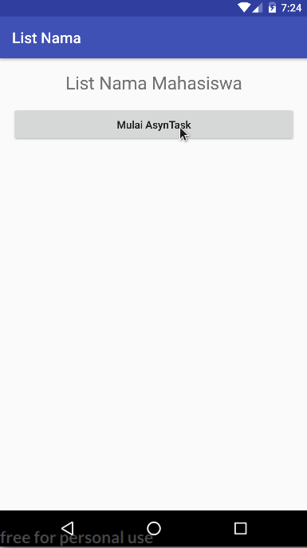
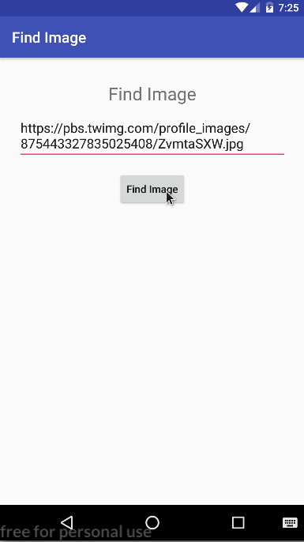

# Project Title
Load Array and Image Using AsynTask




## Getting Started

Cloning Project

```
git clone https://github.com/ataufiq123/AHMADTAUFIQHIDAYAT_1202152178_MODUL4.git
```

## Built With

* Asyntask
* Save Image to Bitmap


